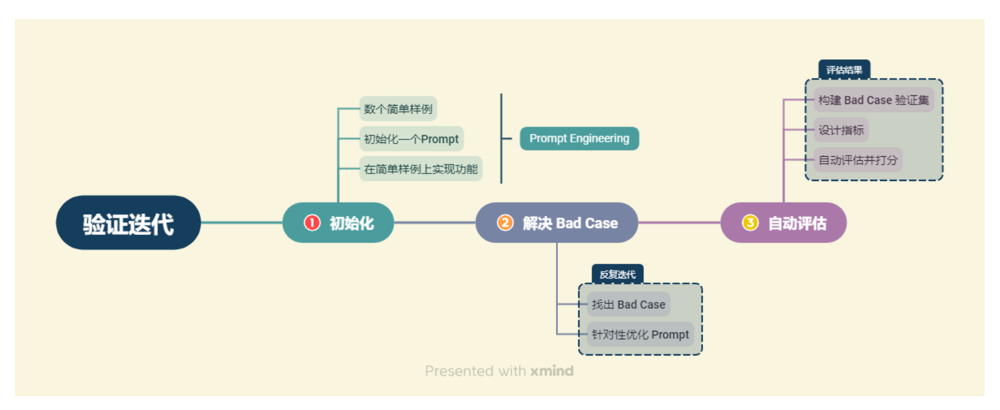

# 生成评估
LLM构建应用程序,所经历的流程如下

## 人工评估
人工对验证集中的每一个验证案例进行评估，可以有以下准则进行参考
* 进行量化（就是给分制）
* 多维量化评估（就像大学里的综测）
## 自动评估
* 构建客观题评估
* 相似度评估
## 大模型评估大模型
通过构造 Prompt Engineering 让大模型充当一个评估者的角色，从而替代人工评估的评估员；同时大模型可以给出类似于人工评估的结果，因此可以采取人工评估中的多维度量化评估的方式，实现快速全面的评估。
# 生成优化
* 针对bad case 改进prompt，使其答案更清晰直观
* 要求模型生成回答时给出依据
* 思维链构造
* 采取Agent机制，多智能体协同，单一智能体只做一件事
# 检索评估与优化
检索部分的检索精确率和召回率直接影响整体性能，因为只有检索到正确的答案文档，生成部分才能输出正确结果。
##  常见bad case 以及优化方案
* 知识片段被割裂导致答案丢失  
采取更合适的分割方案是行之有效的
* query 提问需要长上下文概括回答  
优化知识库构建方式。针对可能需要此类回答的文档，增加一个步骤：通过使用 LLM 来对长文档进行概括总结，或者预设提问让 LLM 做出回答，将此类问题的可能答案预先填入知识库作为单独的 chunk，来一定程度解决该问题。
* 关键词误导  
对用户 query 进行改写，这也是目前很多大模型应用的常用思路。
* 匹配关系不合理  
优化向量模型或是构建倒排索引。我们可以选择效果更好的向量模型，或是收集部分数据，在自己的业务上微调一个更符合自己业务的向量模型。
