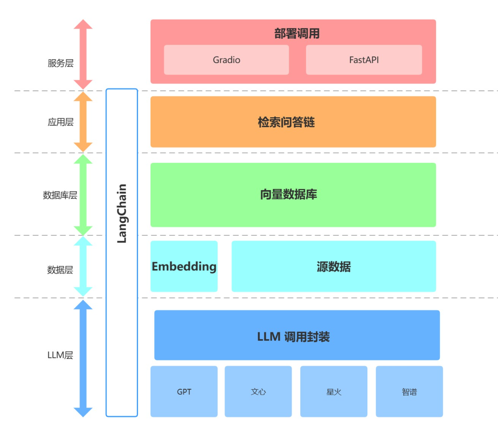

# 项目封装示意

① LLM 层主要基于四种流行 LLM API 进行了 LLM 调用封装，支持用户以统一的入口、方式来访问不同的模型，支持随时进行模型的切换；

② 数据层主要包括个人知识库的源数据以及 Embedding API，源数据经过 Embedding 处理可以被向量数据库使用；

③ 数据库层主要为基于个人知识库源数据搭建的向量数据库，在本项目中我们选择了 Chroma；

④ 应用层为核心功能的最顶层封装，我们基于 LangChain 提供的检索问答链基类进行了进一步封装，从而支持不同模型切换以及便捷实现基于数据库的检索问答；

⑤ 最顶层为服务层，我们分别实现了 Gradio 搭建 Demo 与 FastAPI 组建 API 两种方式来支持本项目的服务访问。

本次主要是项目实例，事实上，就是前五章所学习的内容进行了汇总，

构建知识库->构建问答链
Agent（MetaGPT等）：利用 Agent 架构得到更丰富、更定制化详细的回答。

知识库：使用向量数据库，直接检索人情世故法则（比如餐桌上一般怎么喝酒）。

模型训练：基于不同优秀的模型基座，在积累大量数据的情况下进行Lora微调或全量微调